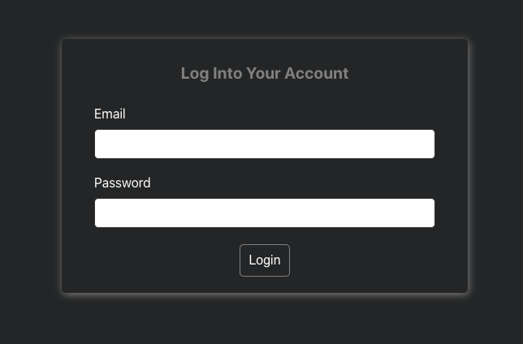

# Let's Chat 

This project was built with React.js & Firebase

## Description

This chat application allows users to interact within each other via text messages
    1) Sign in or sign up and create a user profile
    
    

    2) Have the ability to change the default profile picture to your own, get notified whenever you receive a new message, send text or image messages, and see when friends or family members are online.
    

   

